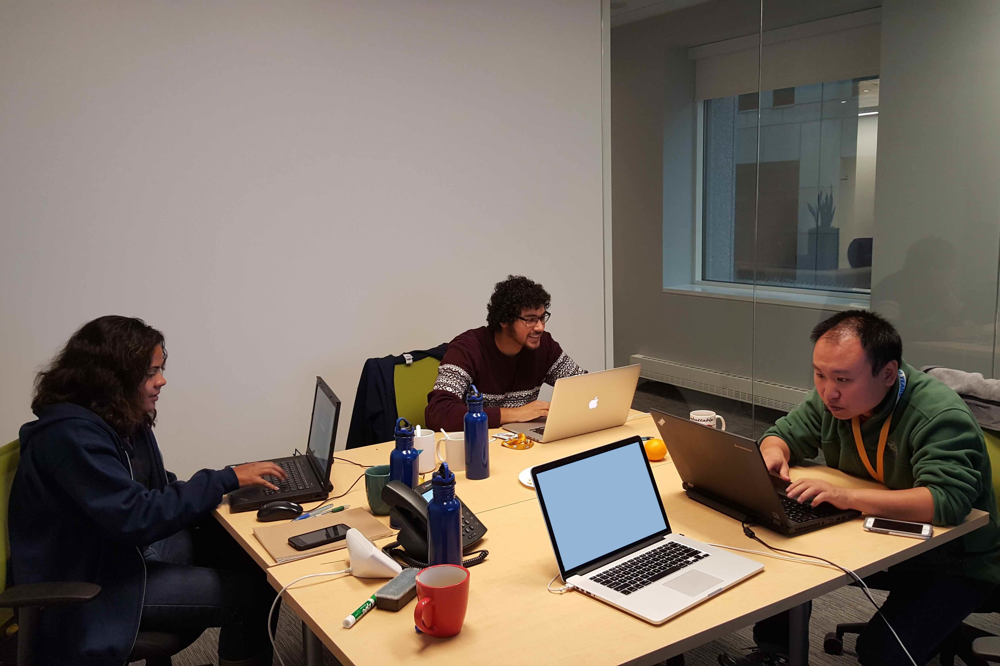

# Why you should hire me

As a seasoned Software Engineer with over a decade of diverse experience across Full-Stack development, Cloud Engineering, and Technical Support, I bring a rare blend of pragmatic problem-solving, technical breadth, and cross-functional collaboration. From building customer-facing ad optimization tools at Amazon Ads to developing internal chatbot integrations, DevOps scripts, and enterprise dashboards at SAP, I've repeatedly delivered scalable, performant, maintainable, and user-oriented software across industries.

I value knowledge-sharing, simplicity in design, and systems that empower people — not just specific users, but everyone. Whether maintaining production at scale, architecting clean APIs, or building performant tools that make people life easier, I move fast, learn deeply, and deliver with impact. If you're looking for a versatile engineer who can ship, mentor, and innovate — I'm ready.

## My favorite contributions 

### At Amazon Ads

I engineered and optimized core frontend features for a major Demand-Side Platform (DSP), helping advertisers manage and visualize campaigns and its metrics (e.g. Clickthrough Rate, Return on Ad Spend (ROAS)).

One of my standout contributions was designing a React-based feature for sharing MFE state changes to legacy JSP components—bridging gaps between old systems and new architectures without disrupting the user experience. Where I also rewrote the core state management system within an internal micro-frontend (MFE) app, resulting in 4x less redundant functions per state change to the JavaScript callstack - ultimately, producing faster performance on critical rendering changes, and significantly improving responsiveness across campaign management workflows. 

There, I've led the migration of different monolith components to micro-frontends, automated vulnerability checks in pipelines, and even prototyped AI solutions winning 2nd place in an internal hackathon.

### (To be added...)

## Toolbox

My toolbox spans modern languages such as **[Java](../assets/java-meme-letmeexplain.jpg), [TypeScript](../assets/js-new-framework-meme.jpeg), Golang, and more** — and I thrive in fast-paced, legacy-to-modern environments. I also work fluently with modern frameworks and dev environments such as **React, Typescript, Next.js/Tanstack, REST/GraphQL, Node, JVM and containerized pipelines on different cloud platforms** — and I don't just build UI: I build tools that make development faster, easier, and more collaborative. Whether it's implementing performant UIs, chatbot integrations, internal CLIs, or creating visualizations that drive user insights, I bring both precision and creativity to the frontend space.
